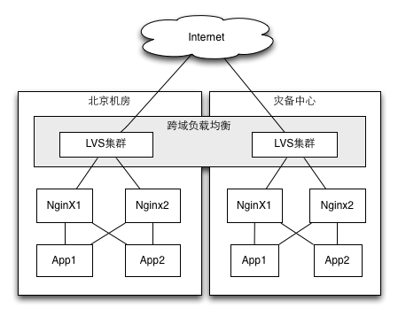

LVS调研报告及对Web负载均衡的方案建议

摘要。。。。

# 对分布式架构的需求

随着摩尔定律的失效，“分布式架构”逐级成为主流。

各个层面

# LVS简介

# web负载均衡方案建议

对性能要求最突出的就是系统的web访问层。对web访问层的架构通常有下列合理的目标和要求：

- 低成本：“云时代”应该避免使用昂贵的商业软件，否则大量的节点数量会带来高昂的授权费用
- 高性能：能够达到百万并发的级别
- 高可用：整个架构无单点故障，支持异地容灾，最好是双活的容灾备份
- 易维护：无论是web内容的发布和部署，还是整个架构的监控和运维，都无需过多的人工干预

## 现状

拓扑及说明

不满足的目标

## 架构方案

web集群和负载均衡的技术主要有DNS（包括智能DNS）、CDN（内容分发网络）和IP负载均衡。

要实现上述目标，需要综合运用

## 分步实施

# 分布式技术研究和储备建议

LVS、ZeroMQ、。。。。。。

# 参考资料

# 素材

三种技术中，IP负载均衡技术是重要的基础。对IP负载均衡的实现既有硬件设备（如F5）又有软件方式（如LVS、NginX、HAProxy)。
信息技术中心现有的基础设施架构中，使用了F5和NginX分别解决链路负载均衡和应用负载均衡的问题。

本方案试图用LVS替代F5，与NginX配合，提出一种低成本的、一致的负载均衡方案，
并在此基础上结合DNS轮询和CDN技术，探讨跨越总部机房和灾备机房的分布式系统架构实现。

TODO：原理图，from RHEL docs

LVS可以支持UDP，能够用于视频会议系统等场景

# 现状分析

信息技术中心之前实施了基于NginX的负载均衡方案，使用NginX反向代理多个应用服务器，实现应用服务器的负载均衡，
并通过NginX对域名和虚拟目录进行统一的管理。
经过半年多的使用，该方案收到了良好的效果，已经应用到外网、办公网和内网的多个应用系统。

对于外网系统，信息技术中心使用F5来解决链路负载均衡的问题，根据用户的网络情况选择不同ISP的链路连接到服务器。
如下图：

1. F5 负责Web服务器的负载均衡，支持多链路负载均衡
2. NginX 负责应用服务器负载均衡，支持域名、虚拟目录的重定向
3. 如果同时需要多链路负载均衡和虚拟目录重定向功能，需要F5与Nginx级联
4. F5 为双节点集群方式，NginX为双节点主备方式 

从公司整体基础设施架构的角度来看，目前的架构还有存在一些问题和改进之处：

1. F5价格比较昂贵，而且配置相对复杂，扩展的弹性不足。
2. 现有的NginX采用主备方式实现HA，只有单个节点工作。
   在目前的虚拟机环境下每秒处理请求约2.4万，最大并发用户数为700左右。
   这样的负载能力不足以支撑互联网应用。
3. 不具备广域域负载均衡的能力，无法在总部和灾备中心之间进行负载调度。机房和灾备中心不能同时提供服务。
4. 不同的应用系统采用不同的架构方案，带来复杂性。

# 架构方案

1. LVS工作在4层，实现多链路和广域的负载均衡
2. NginX工作在7层，实现域名和虚拟目录管理、会话保持、访问控制等功能
3. 每个区域的LVS均为多节点集群
4. NginX从主备方式改为多节点集群方式，解决负载能力不足的问题

## LVS简介

LVS是上述架构中的核心组件。

[LVS(Linux Virtual Server,Linux虚拟服务器)](http://www.linuxvirtualserver.org/)，是由[章文嵩博士](http://zh.linuxvirtualserver.org/)发起的开源软件(GPL许可）。现在LVS已经是Linux内核(>2.4)的一个内置模块，同时支持FreeBSD系统。

LVS工作在4层，支持大多数的TCP和UDP协议。支持TCP协议的应用有：HTTP，HTTPS ，FTP，SMTP，POP3，IMAP4，PROXY，LDAP，SSMTP等。支持UDP协议的应用有：DNS，NTP，ICP，视频、音频流播放协议等。可以用于Web服务、Cache服务、DNS服务、FTP服务、MAIL服务、视频/音频点播服务等。

LVS具有极高的性能，可以支撑上百万的并发连接。

## 虚拟IP与负载均衡

任何负载均衡技术都要建立某种一对多的映射机制: 一个请求的入口映射到多个处理请求的节点。LVS属于IP负载均衡机制，将一个虚拟IP(Virtual IP,VIP)与后端多个真实服务器建立映射关系，客户端访问虚拟IP，LVS根据一定的调度策略和后端服务器的状态将请求转发到真实服务器(Real Server)。
根据所采用的实现技术不同，真实服务器可以将应答报文直接返回客户端或者经过LVS返回客户端。如下图：

LVS支持[多种IP负载均衡技术](http://thinkinside.tk/2013/06/02/lvs_lb_strategy.html)，包括VS/NAT, VS/TUN, VS/DR和VS/FULLNAT。

其中VS/TUN和VS/DR由真实服务器直接应答，所以性能较好，但是网络配置复杂，服务器有暴露的风险，运维成本较高；而VS/NAT的负载能力相对较差。

VS/FULLNAT是淘宝最新开源的LVS , 资料少

拟采用CS/NAT方式，即通过NAT技术

TODO:图和说明

## 调度算法的选择(?)

## 健康检查
  LVS支持4-7层健康检查
  LVS之间有心跳检测（keepalived?)

## 会话保持

TODO:图， 红框，通道。原理（同一IP/mac地址，LVS的策略，NginX的策略）

## 安全

## 部署结构

防火墙之后，网段/子网，真实服务器等，参考》RHEL文档

## 广域、多链路负载均衡

LVS的DR模式，支持通过广域网进行负载均衡。这个其他任何负载均衡软件目前都不具备。

简单的 :DNS轮询不能保证可靠性
中等的： GeoDNS:  求推荐靠谱的GeoDNS服务商:dnspod实在是有点慢
	http://dyn.com/
	GeoDNS是根据用户地理位置解析到不同的IP上
	推荐 dyn.com 我在用twitter.com 也在dyn的服务，不过他们的服务级别比我用的要高，当然价格也贵。。
  智能DNS：
  自建DNS服务器：

复杂的，需要网络运营商的配合，才能能在真正的BGP路由中插入VIP地址。一般来说运营商很少作这样的设置。
需要LVS使用VS/DR模式？？？

过于复杂

## LVS集群

## LVS方式

## 管理和维护

## 性能测试

实验环境：LVS-->NginX(2)

---
4. 文件同步，共享存储，内容分发，自动部署等
5. 可管理性
---

文件同步，共享存储，内容分发，自动部署等
  SQUID缓存1.登录后点击左侧按钮，将本资流分享出去；CDN

# 实施计划

1. 先外网，后内网
2. 先总部，后新疆
3. 逐步增加cache 服务器等

# 方案扩展

要实现总部机房和灾备机房同时对外提供服务，除了解决广域负载均衡问题外，还需要一系列的配套设施才能实现。

可以有两种方式实现：CDN方式和分布式架构方式。

## CDN方式
缓存和镜像

4、缓存
　　缓存一词搞技术的都接触过，很多地方用到缓存。网站架构和网站开发中的缓存也是非常重要。这里先讲述最基本的两种缓存。高级和分布式的缓存在后面讲述。

　　架构方面的缓存，对Apache比较熟悉的人都能知道Apache提供了自己的mod_proxy缓存模块，也可以使用外加的Squid进行缓存，这两种方式均可以有效的提高Apache的访问响应能力。

　　网站程序开发方面的缓存，Linux上提供的Memcached是常用的缓存方案，不少web编程语言都提供memcache访问接口，php、perl、c和java都有，可以在web开发中使用，可以实时或者Cron的把数据、对象等内容进行缓存，策略非常灵活。一些大型社区使用了这样的架构。

　　另外，在使用web语言开发的时候，各种语言基本都有自己的缓存模块和方法，PHP有Pear的Cache模块和eAccelerator加速和Cache模块，还要知名的Apc、XCache（国人开发的，支持！）php缓存模块，Java就更多了，.net不是很熟悉，相信也肯定有。

5、镜像
　　镜像是大型网站常采用的提高性能和数据安全性的方式，镜像的技术可以解决不同网络接入商和地域带来的用户访问速度差异，比如ChinaNet和EduNet之间的差异就促使了很多网站在教育网内搭建镜像站点，数据进行定时更新或者实时更新。在镜像的细节技术方面，这里不阐述太深，有很多专业的现成的解决架构和产品可选。也有廉价的通过软件实现的思路，比如Linux上的rsync等工具。

## 分布式架构方式

这种方式比较复杂，但是实现了真正的双活、双中心，能极大提高灾备中心的资源利用效率。
分布式架构如下图所示：

其中有一些关键的技术问题需要解决：
1. 虚拟IP管理
尽管在内部网络中有DNS，但是重要的IP地址最好虚拟化。
LVS工作在四层，不仅可以用于web服务器的负载均衡，还可以应用在更多场合，比如db(mysql）
交由lvs托管，比如数据库的ip、webservice服务器的ip等等，这些ip地址随着时间推移，使用面会越来越大，如果更换ip则故障会接踵而至。所以将这些重要ip交给lvs托管是最为稳妥的，这样做的唯一缺点是需要的VIP数量会比较多。
1. 分布式文件系统/共享存储
后端存储通常用容错的分布式文件系统，如AFS、GFS、Coda和Intermezzo等。分布式文件系统为各服务器提供共享的存储区，它们访问分布式文件系统就像访问本地文件系统一样。同时，分布式文件系统提供良好的伸缩性和可用性。然而，当不同服务器上的应用程序同时访问分布式文件系统上同一资源时，应用程序的访问冲突需要消解才能使得资源处于一致状态。这需要一个分布式锁管理器（Distributed Lock Manager），它可能是分布式文件系统内部提供的，也可能是外部的。开发者在写应用程序时，可以使用分布式锁管理器来保证应用程序在不同结点上并发访问的一致性。

2. 应用发布和自动部署
3. 消息队列（4层）ESB(7层)
3. 数据库实时同步
4. 数据库集群
   - LVS可以作为mysql集群的前端负载均衡器
   - oracle:?

# 小结

- [+] 方案评价
    - [+] 与nginx only对比
    - [+] 与F5对比
分步实施

双中心的解决：必须解决分布式系统的问题：
数据库系统、缓存系统、分布式存储系统等

