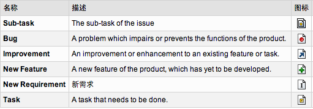

% Atlassian Jira
% 问题跟踪系统
%   王海阔 @hysec.com, 2014

# Tips

http://thinkinside.tk/presentations/jira.html

请使用 **现代** 浏览器

- Chrome, Safari, Firefox, Opera ...
- 如果一定要使用IE，请使用IE10+

# 项目中的“问题”

## issues不是problems

- 任何需要开展行动的事情
- Jira汉化版中翻译为“事件”

有影响，需要处理的事情
缺陷，新需求，改进，新特性，任务和子任务，其他任何事情
常见的有以下几种（Jira中内置的）

## bugs

我们最熟悉的
bug(缺陷)：软件中存在的导致软件产品在某种程度上不能满足用户的需要的错误。产生原因：
1）设计不合理;
2）功能未实现；
3）与需求不一致;
5）用户不能接受的其他问题，如存取时间过长、界面不美观;
6）甚至，软件实现了需求未提到的功能。

很多概念来自于bug,比如：级别

## bug levels

一般分成几个级别：致命的(Fatal)，严重的(Critical)，一般的(Major)，微小的(Minor),建议(Enhancemental)

## New Requirement

项目之痛
新需求，需求变更
软件为了达到目标所要具备的条件或能力。（多种定义）

## Improvement

对已实现的特性的改善或提高
我们真的很努力

## New Feature

新提出的、尚未实现的特性

## Task and Sub-Task

项目的进度和任务可以在jira中管理

## ANYTHING else...

- 可扩展
- 完全可以自己定制
- 比如: Jira最新版，help-desk

	
# 如何应对

## 争论和扯皮？

一个故事，email

## 救火队员？

## 沟通和协调？

## 自我管理？

## 作为一个团队

## 需要的是流程化

## 基本流程

如何处理？很简单！
一般过程：4个步骤
提出问题，分析/分配问题，解决问题，验证问题
也就是，用户或测试/负责人/开发人员/测试人员

# Jira介绍

## 全球知名小公司 “高富帅”的CEO

公司：Atlassian [ætlɑʒen]，澳大利亚, “全球知名小公司”
Jira， confluence，crowd：项目管理三剑客
问题管理，企业级wiki, 统一认证和单点登录(OpenID)
（现在Crowd已经被替换为 HipChat，一个IM工具）
bitbucket：代码托管平台

2002年，启动资金为1万美元的信用卡贷款，当年实现盈利
2010年，收入5900万美元

创始人兼CEO：Mike Cannon-Brookes
- 《Java Open source Programming》的合著者
- 开源社区OpenSymphony的创始人
  Opensymphony 2010年11月份关闭
  诞生的高质量项目：（java）
    + WebWork：后来作为struts2的核心
    + Quartz ：任务调度
    + OSWorkflow：工作流引擎

## JIRA的定位

- 问题跟踪系统(Issue Tracker)
- 协同各角色的工作(workflow)
- 促进交流和反馈(Notify and Subscribe)

## 事件的分类

------------------

## 事件的属性

------------------

## 针对事件的行动

一个有限状态机：核心的四个状态
松散控制：增加直接的通路
基于reopened状态：适应现实的复杂性

## Ticket

传票系统，标记事件的当前处理人
一个事件，一系列ticket
通过ticket可以跟踪处理过程，了解项目进度等

## 项目状态

以上是针对单个事件
整个项目，图表统计
30天汇总, 已创建 vs 已解决

reporting and statistics
支持图形和图表的个性化的报表，可以监控所有issues的进程

	

------------------

项目事件状态

	
------------------

按各种指标分类汇总

------------------

## portal

上面报表的集成
可定义，可分享

	

------------------

## 邮件通知

## 订阅项目活动

## 小结：基本概念

## 小结：Jira的用途

can use as

- bugs/changes requests tracking
- help-desk/support/customer service
- project management
- task tracking
- requirements managment
- workflow/process mgnt

## JIRA的特点

- 基于Web
- 开源，不免费
- 多种“事件”类型
- 自定义事件字段
- 可定义的工作流
- 更强大的权限管理
- 时效管理
- 自定义dashboard
- 上传附件
- 和cvs/svn的集成

# Demo

操作示例

## 

- 创建issue
- 操作issue (comment &sdot; assign &sdot; watch &sdot; workflow)
- 子任务
- 导航和搜索
- 过滤器 (创建 &sdot; 分享)
- 报告(report)
- Dashboard( 自定义 &sdot; 分享)
- 通知和订阅

# Powered by

others

## 

- Markdown
- reveal.js
- github

关于轻量级presentation

# Q&A

